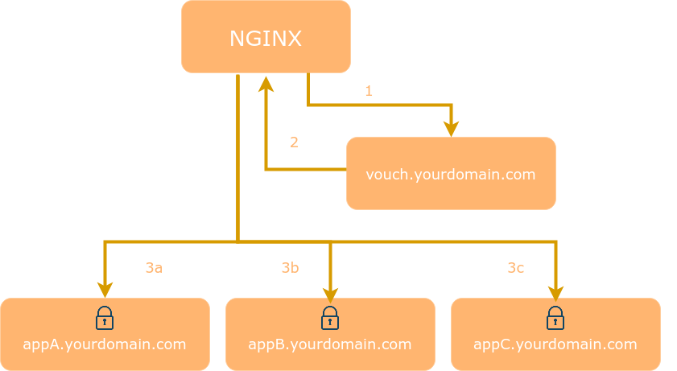

# Grav NginxSso Plugin

The NginxSso plugin for [Grav](http://github.com/getgrav/grav) adds the ability of Single Sign On by integrating with [Nginx SSO](https://github.com/elementdavv/nginx-sso).

## Installation

About installation and configuration of nginx-sso, please refer to [Nginx SSO](https://github.com/elementdavv/nginx-sso).

Install the NginxSso plugin manually:

```
$ cd /yoursite/user/plugins
$ git clone https://github.com/elementdavv/grav-plugin-nginxsso.git nginxsso
```

## Configuration

Simply copy `user/plugins/nginxsso/nginxsso.yaml` to `user/config/plugins/nginxsso.yaml` and make your modifications.

## How does [Nginx SSO](https://github.com/elementdavv/nginx-sso) work

[Nginx SSO](https://github.com/elementdavv/nginx-sso) is working at domain level. It runs in the same one nginx deployment with web applications.

[Nginx SSO](https://github.com/elementdavv/nginx-sso) forces visitors to login and authenticate before allowing them to access a web application. Every request is checked to ensure that it is valid.



After authenticated, Nginx SSO sends the visitor's email to web applications.

## What does NginxSso plugin do

The NginxSso plugin obtains the email from HTTP header, logins the user automatically in grav if not logined, and register the user if needed. If there is no email in HTTP header, the NginxSso does nothing. It does not interfere with Grav-builtin login plugin.
